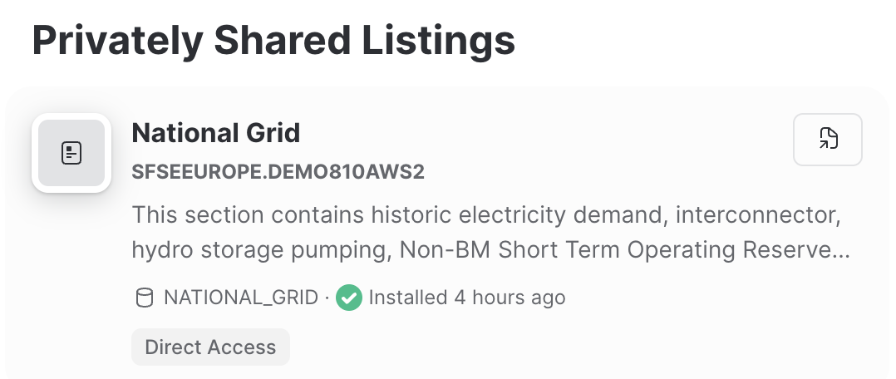
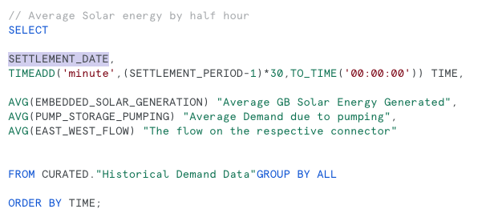
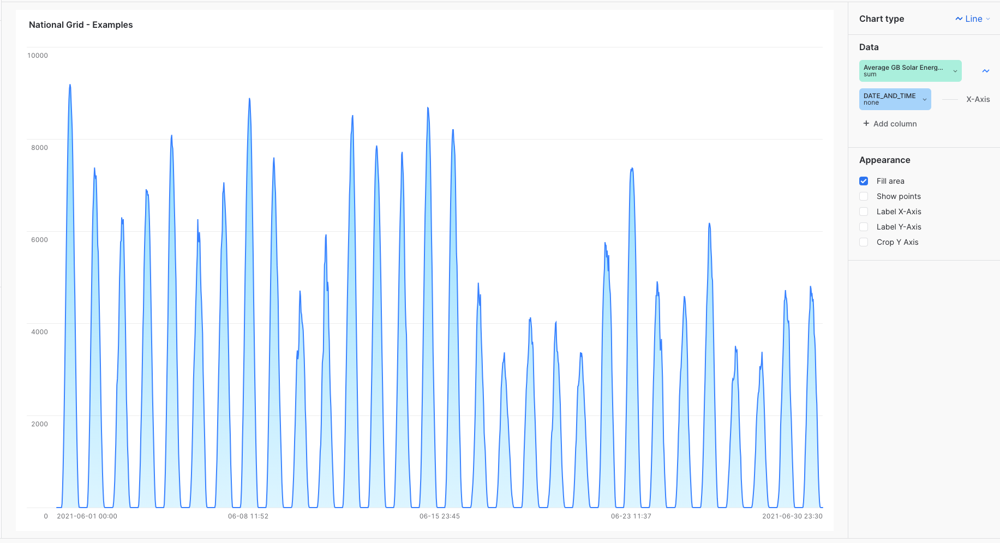
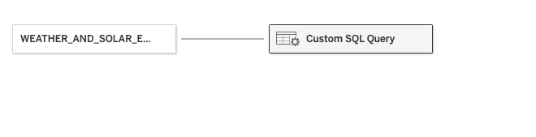
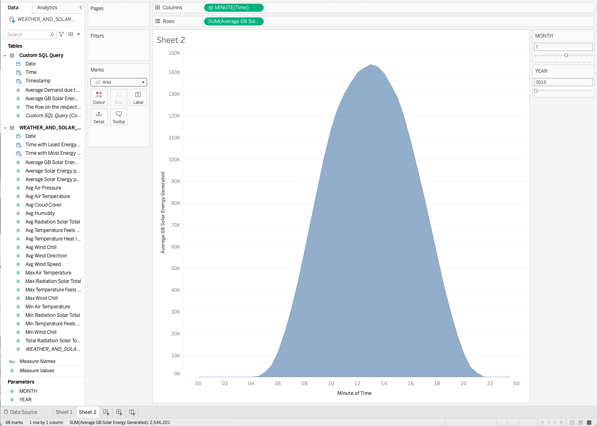

#  Analyse Energy Data in Snowflake


All information to complete the hands on experience is provided on this page.

Please use a new tab to open the  URL provided separately

<URL FOR TRIAL ACCOUNT NOT SETUP YET>

You have all been given a username which will be in the format as below:


<table>
<tr><td>Username</td><td>Password </td>
</tr>
<tr>
<TD>USER1</TD><TD>PW123456789!</td>

</TR>
</table>


* You will be accessing a trial account - Each user is granted access to a share which contains the datasets for the lab


* The main dataset contains energy usage over time using National Grid Open data.  We will be comparing this against weather data.  The data for this is a subset of data provided by <b>Weathersource</b> open data which is freely available on the  Snowflake Market Place. 

* The second dataset focuses on energy usage by geographical location within the UK.  We will be comparing this against Deprivation data provided by the ONS open data.

* You will be saving views of the data in your own allocated database

* If you have access to tableau desktop, you will be able to connect to your own database and create visualizations from the views

* Finally you will build a Streamlit app which will display the results as an interactive dashboard.


#### 0. Quick Orientation

* Log into Snowflake using the URL and Credentials provided.  When asked, change  your password to a password which you will remember.  If you forget your password, please ask a helper to reset your password on your behalf.

Once logged in you will see a screen which looks like this:


* Click on the Data icon and navigate to Databases.  You will notice that the Databases include the following:

    * <b>NATIONAL_GRID</b> all users will have access to the same shared data asset.  This data share has been provided by another Snowflake account

    * <b>ENERGY_CONSUMPTION_ANALYTICS_*</b> (where * = your user number) - this is a local database and is unique to your username. The setup contains a database for every user so you can freely create views / schemas and functions without affecting other users.


* Click in the admin area - you will be supplied with 1 warehouse.  This will allow you to process queries.  You will be sharing a warehouse with some of your fellow users - the warehouse will automatically scale out if more power is needed to allow for simultaneous querying without performance issues.


### 1. Leveraging the data from the share

* Click on Data and then Private Sharing.  You will see the following share which is available:



By clicking on the share, you will see more information about the data which has been securely assigned to the share.

* Click on the  to open a new worksheet with pre defined queries


### 2. Running Queries from the Share Templates

You will notice that every SQL statement is separated by a semi colon.  Below is a screenshot of the first query.  You will notice the semi colon at the end.


To run one query, place your cursor anywhere within the SQL statement and press CTRL + enter.

* Select the first query and run it using <b>CTRL + enter</b>

The data is populated within the results window.   Here, once you run a query you can further sort and filter.

This query shows average energy consumption within a 24 hour period.  The 24 hour period is divided into half hour intervals


### 3. Breaking down the Query

We are selecting the field <b>SETTLEMENT PERIOD</b>.  Lets find out more information about that column

* In the databases window, open up the <b>NATIONAL_GRID</b> database

* Open up <b>CURATED</b>

* Open up <b>Views</b>

* Click on <b>Historical Demand Data</b>

On the bottom half of the databases pane, you will see catalogue information which describes the meaning of each field.

* Scroll until you see the description of <b>SETTLEMENT_PERIOD</b>


In the query which we have just run, we have a field to display the format of the settlement period as per the information given on the field.  The field has been created with a calculation.

```sql
TIMEADD('minute',(SETTLEMENT_PERIOD-1)*30,TO_TIME('00:00:00')) TIME
```
This field has has got a name called time.  You can name any calculation simply by typing a name in at the end of the calculation.  This name can then be used to calculate other fields.

There are 3 Measures picked for the query.  The results will be grouped to only show one result per half hour interval, we have chosen to summarize the results by using the AVG function.  This means it will display the average value for every half hour row within the dataset.  The lowest level of detail in this dataset is the date and time.

```sql
AVG(EMBEDDED_SOLAR_GENERATION) "Average GB Solar Energy Generated",
AVG(PUMP_STORAGE_PUMPING) "Average Demand due to pumping",
AVG(EAST_WEST_FLOW) "The flow on the respective connector"
```

We are querying the table from the <b>CURATED</b> Schema.  Think of Schemas as ways to group the data together in a logical way.

Finally we are using a useful syntax called <b>GROUP BY ALL</b>.  This will summarize all the data based on all dimensions provided.  For example, the only dimension provided is the newly created <b>TIME</b> dimension.  

* Now you have the results, click on the query show side toggle  to remove the query from view.

* Switch from Results to Chart

* Within Appearance, change the orientation to vertical bars


You will notice that the chart is not sorted correctly as its defaulting to sort based on bar size.  We would like to sort by TIME

* In the chart type pane, change the order bars by TIME and change the order direction to Ascending order


You will notice that we are now presented with a bell shaped curve where most of the solar energy is generated in the middle of the day - which makes sense.

* Change the measure to view the average demand due to pumping

You will see that the curve changes that the demand seems to happen outside of daytime hours


If you need to add more detail to the query, simply add another dimension to the existing query in order to see more detail.

* Switch back from chart to <b>Results</b>


* Open up the query editor using the previously used switch 

* within the query you have just run, add the <b>SETTLEMENT_DATE</b> by typing the column name in and then <b>CTRL + ENTER</b> to run the query

You will notice that the level of detail has automatically increased to reflect the additional field.



Next, you will create another Column which creates a Date and Time Dimension

* copy and paste the calculation below into the editor <b>after</b> the TIME column and <b>before</b> the three measures:

```sql
TIMESTAMP_FROM_PARTS(SETTLEMENT_DATE,TIME) DATE_AND_TIME,
```

You will notice that you can create calculations based on previously named columns.  

The data is only displaying the first 10000 rows of data.  This is a view limitation (although this limit will be increasing soon).  However you can download the results using the download option 

To get a more manageable list of results, you might filter on date, or create a sample.  You will next use SQL to filter the data.

#### 4. Filtering in SQL

* BEFORE the GROUP BY ALL command and after the FROM command, type in the following:

```SQL
WHERE YEAR(SETTLEMENT_DATE) = '2021' and month(SETTLEMENT_DATE) = 6 
```

* Comment out the settlement date and Date and Time column to temporarily remove the columns from the query. 


* Run the query and switch to Chart View
* Ensure the data area is set to the following:


* Experiment by changing the month number and re-running the query.  What happens to the curve and why?


* Uncomment the Settlement Date and Date and Time and re-run the query

* Change the Chart Type to Line

* Switch the data X-axis to DATE_AND_TIME this will show the shape of the data by month.




You will see times where the dates during peak time are less than other dates.  

You may decide to join to other datasets to find more information out as to why some days produce less Solar Energy in a particular month than others.

Lets move away from this query now, and view the other queries provided in the query examples.

* Navigate back from chart to Results to see the data in a tabular format

* In the Worksheet, Go to the next query (the next statement after the semi-colon) and press ctrl + run to run the query

This is viewing all the original raw data.  You will note that we have more than 10,000 records.  You will see in query details, we are querying <b>256.7K</b> records so lets view a sample of this data to understand the shape as a whole

* Replace this simple query by copying and pasting the following on top of this query

```sql
select * from CURATED."Historical Demand Data" sample (2000 rows);
```

* Re-run the query to view a data sample of 2000 rows

* Close the query pane and examine the query profiler on the right hand side of the results.

* Explore the data profiles and filter as you wish


Now we will run the other sample queries

* Open up the query editor

* put your cursor in the next query (Historical Demand by Month) and press CTRL + Enter to run it

This is showing the average demand by Month across all years since 2016

* Click on the chart and you will see the chart appear like this:


* Now run the next query Historical Demand by Year and view the Chart - You will notice the demand is increasing over time

* Run the query Historic demand by Date

This is what the chart may look like


* Switch back to the Results tab

* Run the next query <b>Historical Demand by Year</b>

* Next, run Historical demand by date - this query is showing averages for each date based on the half hour intervals.  You might want the average to be a daily average instead.  You can do this easily by extending the 'window' of the average with the use of <b>Window Calculations</b> We will cover this later in the lab.

* Run the next query to view weather data within the UK

```sql
SELECT * FROM RAW.WEATHERSOURCE_WEATHER_BY_DATE_IN_UK;
```

This data will be more useful if we can compare with the energy data

* Run the next query to view comparisons between weather data and solar energy

You will notice that this query contains a join.  A join is equivalent to a lookup table in excel. In this case we are joining weather data to a previously used query, and are joining it together by date.

If you go to the chart you will see something that looks like this


*Toggle to the other measure in the data area to see the weather data values - you will see the shape is very similar.

*Let's add a new measure - <b>CLOUD COVERAGE</b> to the query.  Copy and paste the following measure into the query below <B> A.Avg Radiation Solar Total</B> and above<B> B.Average GB Solar Energy Generated</b> 

```sql
A."Avg Cloud Cover",
```
* Re-run the query.  
* Swap Data in the line chart to view the new Cloud Cover field

The next set of queries in the template queries data which shows Gas and Electric Consumption by Location (In this case, it's by LSOA (A Lower Layer Super Output Area which is a GEOGRAPHIC AREA))

* Switch back to the results view and run the Electric Consumption by Location query and view and explore the results.

* Run the Gas Consumption by Location to view the results

* View the Final query which compares Electric and gas consumption by location.

Note we also have Geographic Boundary datasets as well as the indices of deprivation.  This could be useful for supporting geographical analysis.

### 5. Saving views of queries

Now we have created a few queries, let's start creating some views of the data.  This is really useful for repeating the analysis. 

* Create the following views in a new snowflake worksheet.  To create a new worksheet click here:


The new worksheet hs not been allocated a database or warehouse.  Under Database, select <B>ENERGY_CONSUMPTION_ANALYTICS*</B>

* Under Warehouse, select <B>XS_WAREHOUSE_ *</B>

You will create a schema which will be used to store all the views that you will be creating.

* Copy and paste the following command into your new worksheet.

```sql

CREATE OR REPLACE SCHEMA REPORTING_VIEWS;

```

* View one - Paste the following into your new worksheet and run it using <b>CTRL + ENTER</b>

```sql
CREATE OR REPLACE VIEW "Energy Generation" as

SELECT

SETTLEMENT_DATE,
TIMEADD('minute',(SETTLEMENT_PERIOD-1)*30,TO_TIME('00:00:00')) TIME,
TIMESTAMP_FROM_PARTS(SETTLEMENT_DATE,TIME) DATE_AND_TIME,

AVG(EMBEDDED_SOLAR_GENERATION) "Average GB Solar Energy Generated",
AVG(PUMP_STORAGE_PUMPING) "Average Demand due to pumping",
AVG(EAST_WEST_FLOW) "The flow on the respective connector"


FROM NATIONAL_GRID.CURATED."Historical Demand Data"


GROUP BY ALL

ORDER BY TIME

;


```
Next, you will create a query to run the view while applying a filter

*  Copy and paste the following and then run the query

```sql
SELECT * FROM "Energy Generation" where MONTH(SETTLEMENT_DATE) = 6

AND YEAR(SETTLEMENT_DATE) = 2021;

```

You may not wish to share the dataset as a whole with specific users.  For instance, you might like to build in parameters into a view where the user <b>HAS</b> to complete before running the query.  You cannot do this with views alone BUT you can achieve this with <b>Table Functions</b>.

* Copy and paste the below function into your worksheet and run it to create a new table function.

<b>NOTE!!!!</b> - please change the database name to the name of YOUR database - for example ENERGY_CONSUMPTION_ANALYTICS_<font color = red><b>*</b></font> <b>WILL</b> have an alternative suffix

```sql
create or replace function ENERGY_GENERATION_DETAILS(YEAR int, MONTHNO int)
    returns table ("Date" DATE,"Time" TIME(9),"Timestamp" TIMESTAMP_NTZ, "Average GB Solar Energy Generated" INT
    , "Average Demand due to Pumping" INT, "The flow on the respective connector" INT)
    as
$$


SELECT * FROM ENERGY_CONSUMPTION_ANALYTICS_*.REPORTING_VIEWS."Energy Generation"

WHERE YEAR(SETTLEMENT_DATE) = YEAR and month(SETTLEMENT_DATE) = MONTHNO

GROUP BY ALL

ORDER BY TIME
$$
;
```


* Run the function with the following command

```sql
SELECT * FROM TABLE(ENERGY_GENERATION_DETAILS(2021,6));
```

This offers data protection if you wish to only provide data with mandatory filters.  You can also use this function in tableau.  We will cover this in more detail within the tableau section.


### 6. Making use of Window  Functions for Time Series Analysis.

Earlier on we created a view which had time related information.  We summarized the the data using AVG.  Sometimes you may not want the average at row level - it might be a higher level such as the average for the week for example.  You can achieve this simply by using a window function.


First, you will create a view which displays the Embedded Solar Generation Measure by Time, Day, Month and Year

* Copy and paste the query below and run it using CTRL + ENTER which will save the query as a view.

```sql
CREATE OR REPLACE VIEW "Various Average Solar Energy Calculations" as

SELECT
      TIMEADD('minute', (SETTLEMENT_PERIOD - 1) * 30, TO_TIME('00:00:00')) AS TIME,
      DAYOFYEAR(SETTLEMENT_DATE) DAY,
      MONTH(SETTLEMENT_DATE) MONTH,
      YEAR(SETTLEMENT_DATE) YEAR,
      EMBEDDED_SOLAR_GENERATION
    FROM
      NATIONAL_GRID.CURATED."Historical Demand Data";

```
Run the query below
```sql
select * from "Various Average Solar Energy Calculations";
```


We want to use this data to create 3 Averages based on the following:

* The sum of each <B>Day</B> in a Year 
* The sum of each <B>Month</B> in a year 
* The sum of each <B>Year</B> 


Below is a View which totals up the solar generation for every year, month and day.  the <b>PARTITION BY</b> specifies which row combination needs to be totaled.

Finally we will group by the half hourly intervals and will average all our calculations so we can see average per day, average per year and average per month over the time interval period.

* Create amended view by copying and pasting the query below into the worksheet and <b>CTRL + ENTER</b> to run it.

```sql
CREATE OR REPLACE VIEW "Various Average Solar Energy Calculations" as

with solar_grouped as

(

WITH solar_data as 

(
SELECT
      TIMEADD('minute', (SETTLEMENT_PERIOD - 1) * 30, TO_TIME('00:00:00')) AS TIME,
      DAYOFYEAR(SETTLEMENT_DATE) DAY,
      MONTH(SETTLEMENT_DATE) MONTH,
      YEAR(SETTLEMENT_DATE) YEAR,
      EMBEDDED_SOLAR_GENERATION
    FROM
      NATIONAL_GRID.CURATED."Historical Demand Data"
)

select TIME, 
SUM(EMBEDDED_SOLAR_GENERATION) OVER (PARTITION BY TIME, DAY,YEAR) AS SUM_DAY,
SUM(EMBEDDED_SOLAR_GENERATION) OVER (PARTITION BY TIME, MONTH,YEAR ) AS SUM_MONTH  ,
SUM(EMBEDDED_SOLAR_GENERATION) OVER (PARTITION BY TIME, YEAR ) AS SUM_YEAR  
from solar_data

) select 
    TIME, 
    AVG(SUM_DAY) "Average GB Solar Energy Generated per day",
    AVG(SUM_MONTH) "Average Solar Energy per Month",
    AVG(SUM_YEAR)"Average Solar Energy per Year"
    from solar_grouped  group by all ORDER BY TIME;
```

After creating the view, select the data as below


```sql
select * from "Various Average Solar Energy Calculations";
```

Create a Chart similar to this:


Try out the measures for monthly, daily and yearly averages.


### 7. Creating a view to compare Average <b>daily</b> solar energy vs average cloud cover in a day.

Now we can utilize window calculations, we can produce a view that combines weather information (which is already set to daily), with daily averages from the energy dataset.

* Create a View to display Solar Energy Stats on a daily basis.  The view also includes the time where the least amount of energy is generated per day and where the Most amount of energy is generated per day.

```sql
CREATE OR REPLACE VIEW "Average Solar Energy Calculations by Day" as

with solar_grouped as

(

WITH solar_data as 

(
SELECT
      TIMEADD('minute', (SETTLEMENT_PERIOD - 1) * 30, TO_TIME('00:00:00')) AS TIME,
      SETTLEMENT_DATE AS DATE,
      DAYOFYEAR(SETTLEMENT_DATE) DAY,
      MONTH(SETTLEMENT_DATE) MONTH,
      YEAR(SETTLEMENT_DATE) YEAR,
      EMBEDDED_SOLAR_GENERATION
    FROM
      NATIONAL_GRID.CURATED."Historical Demand Data"
)

select TIME, 
DATE,
SUM(EMBEDDED_SOLAR_GENERATION) OVER (PARTITION BY  DATE) AS SUM_DATE,
SUM(EMBEDDED_SOLAR_GENERATION) OVER (PARTITION BY  TIME,DATE ) AS SUM_HALF_HOUR  ,
SUM(EMBEDDED_SOLAR_GENERATION) OVER (PARTITION BY  DATE,HOUR(TIME) ) AS SUM_HOUR  
from solar_data

) select 
    DATE, 
    AVG(SUM_DATE) "Average GB Solar Energy Generated per day",
    AVG(SUM_HALF_HOUR) "Average Solar Energy per Half Hour",
    AVG(SUM_HOUR)"Average Solar Energy per Hour",
    MIN_BY(TIME,SUM_HOUR)"Time with Least Energy Generated",
    MAX_BY(TIME,SUM_HOUR)"Time with Most Energy Generated"
    


    
    from solar_grouped group by all ORDER BY DATE;

```
* Run the query as below:
```sql
select * from "Average Solar Energy Calculations by Day" where "Average GB Solar Energy Generated per day" <> 0;
```

Finally, lets join this view to the weather data.

Copy and paste the following to create a weather vs solar energy comparison view

```
CREATE OR REPLACE VIEW WEATHER_AND_SOLAR_ENERGY_COMPARISONS AS 
SELECT A.*, B.* EXCLUDE(date_valid_std, COUNTRY) FROM "Average Solar Energy Calculations by Day" A

INNER JOIN 

NATIONAL_GRID.RAW.WEATHERSOURCE_WEATHER_BY_DATE_IN_UK B

ON A.DATE = B.DATE_VALID_STD

```
Query the view by typing the following:

```
SELECT * FROM WEATHER_AND_SOLAR_ENERGY_COMPARISONS;

```

### 8. View Results in Tableau 

You can now connect your dataset to a tableau workbook which will allow you to explore the data with extensive visualization capabilities.

If you have access to Tableau desktop:

* Open up Tableau desktop

* From the Connect menu, connect to snowflake


* Populate your connection details using the connection details provided and press <b>Sign In</b>

* Under Database, Select the Energy Consumption Analytics Database.

* Under Schema, Select Reporting Views

* Drag Weather and Solar Energy Comparisons


* Press Update Now to Preview the Data

* Click Sheet 1 to create visualizations based on this dataset


Do you remember that we created a function to filter a data set using user defined parameters.  We can use this in Tableau!

* Go back to the Data Source Area

* Drag a New Custom SQL query into the query editor

* Paste the following into the query editor

```sql 
SELECT * FROM TABLE(
ENERGY_CONSUMPTION_ANALYTICS_1
    .REPORTING_VIEWS
    .ENERGY_GENERATION_DETAILS(2021,6))
```

* Replace _1 with your database number
* Highlight 2021 and Select Insert Parameter then choose <b>Create a New Parameter</b>

* Populate the Parameter box with the following:

* When complete, press OK
* Highlight 6 and Insert Parameter
* Populate the Parameter box with the following:

* When complete press OK
* Press OK to return to the Data Source



* Create a new Worksheet and Create a Visual using the fields inside the Custom SQL Query table.  Below, I chose to display the parameters so I can change them on the fly.  This will run run the function each time the user changes the parameter.




### 9. Create a streamlit application

We have now created some data views which we have explored using both Snowsight and Tableau.  Now, the next step would be to create an application which uses the data for any user with the required permissions to explore.

Go back to the home page and click on the <streamlit> icon.


Click on the  to create a new Streamlit App.

Populate the popup menu with your warehouse and database and name the app with your username as the suffix.  


Press <b>Create</b>


Your streamlit application will generate a sample page. You may notice that the application is written in Python.  We will be creating a page based on the data in our newly created views.  We can query the views using <b>Snowpark dataframes</b>

* Delete ALL content <B>AFTER</B> get_active_session().

* Press Run to Refresh the page

* Replace the title line with the following

```python
st.title("Energy Insights")
```

* Replace the Narritive with the following:

```python
st.write("This app displays potential pattens between solar generation over multiple time frames and compares with Weather data in 2021")
```
* Re Run to refresh the page

Lets now add a table to display data on the page.

* Copy and paste the following <b>underneath</b> the session line

```python
df = session.table('ENERGY_CONSUMPTION_ANALYTICS_1.REPORTING_VIEWS.WEATHER_AND_SOLAR_ENERGY_COMPARISONS')
```
If you run the report nothing changes.  This is because we have not chosen how to display the data.  You can display the data in lots of different ways such as charts and tables.

Lets display the data as a dataframe

```python
st.dataframe(df)
```

you will note that it will only display 100 rows unless you use the collect() function.  Collect() caches all the data in memory.

In this exercise, I will choose to display only the top 10 days based on average solar energy generated per day

* Add the following modules from Snowpark - this will allow you to use Snowflake functions in Snowpark

```python
from snowflake.snowpark import functions as F
```

* Amend the dataframe by adding the following as a new line.

```
df = df.order_by(F.col('"Average GB Solar Energy Generated per day"').desc()).limit(10)
```
* re-run the query

We will now select to columns to compare solar energy generated per day and Average Cloud cover.  After selecting the columns you will round the measures to something more meaningful.

Copy and paste the following lines at the bottom of the code.

```python
df = df.select('DATE','"Average GB Solar Energy Generated per day"','"Avg Cloud Cover"')

df = df.with_column('"Average GB Solar Energy Generated per day"',F.round('"Average GB Solar Energy Generated per day"'))

df = df.with_column('"Avg Cloud Cover"',F.round('"Avg Cloud Cover"'))
```

* re-run the query

Let's create a slider that will allow a user to select a date range.

* Add the following code below the first df line (i.e df = session.table.....)

```python

# select the dates
dates = df.select(F.min('DATE').alias('"StartDate"'),F.max('DATE').alias('"EndDate"')).to_pandas()

# create a filter range based on selected dates
filter_df = st.slider('Date Range',value=(dates.StartDate.iloc[0],dates.EndDate.iloc[0]))

# filter the dataframe based on the selected date range
df = df.filter((F.col('DATE')>=filter_df[0])&(F.col('DATE')<=filter_df[1]))

filter_df = st.slider('Date Range',value=(dates.StartDate.iloc[0],dates.EndDate.iloc[0]))

```
* Reload the page and use the slider to amend the dataframe - it will show the top 10 <b>AFTER</b> you filter the original dataset by date range

The code and visual will look like the screenshot below:
`


Let's now create some visualizations

* underneath st.dataframe(df) add the following line:

```python

st.line_chart(df,y='Average GB Solar Energy Generated per day',x='DATE')

```

* Re-run the page

You will note that the chart is only displaying the top 10 (as we previously filtered the data during the the dataframe flow.)

* Comment out the filter to view the data for all rows by placing a hash before .limit(10).  It will look similar to the screenshot below:


* Create a second line chart which shows Cloud Cover

```python
st.line_chart(df,y='Avg Cloud Cover',x='DATE')
```

* Remove st.dataframe(df)

You will notice that the second line chart is really difficult to read trends.  You might want to use a Window calculation in order to show moving averages over a definable period.  Not only can you use window calculations in SQL, you can also use them in Snowpark Dataframes too.

* At the top of the page import Window functions and data types

```python
from snowflake.snowpark import Window
from snowflake.snowpark import types as T

```

* Under the last dataframe transformation (the line where we added cloud cover), add the following 3 lines:

```python
# Create a Window to create a moving average based on a defined number of days (as each row represents 1 day)
window = Window.order_by(F.col('DATE').asc()).rows_between(Window.currentRow,14)

# Add a moving average column based on the previously defined window
df = df.with_column('"7 Day Moving Average"',F.avg('"Avg Cloud Cover"').over(window)).sort('"DATE"')

# Change the data type to a float
df = df.with_column('"7 Day Moving Average"',F.cast('"7 Day Moving Average"',T.FloatType()))
```

* Replace the column name in the line chart to show 7 Day Moving Average instead of Avg Cloud Cover

Your app should now look like this:


Let's now layout the page to make it more readable and add some titles.

*  Highlight all of your code and delete it
*  Replace the code with the following:

### 10. Load the completed code into the Editor and run the completed app.

```python

# Import python packages
import streamlit as st
from snowflake.snowpark.context import get_active_session
from snowflake.snowpark import functions as F
from snowflake.snowpark import Window
from snowflake.snowpark import types as T
# Write directly to the app
st.set_page_config(layout="wide")
st.title("ENERGY INSIGHTS IN SNOWFLAKE")


# Get the current credentials
session = get_active_session()


df = session.table('WEATHER_AND_SOLAR_ENERGY_COMPARISONS')

# select the dates
dates = df.select(F.min('DATE').alias('"StartDate"'),F.max('DATE').alias('"EndDate"')).to_pandas()

# create a filter range based on selected dates
filter_df = st.slider('Date Range',value=(dates.StartDate.iloc[0],dates.EndDate.iloc[0]))

# select weather measure to compare Solar energy with

weather_measures = ['Avg Cloud Cover','Avg Air Temperature','Avg Temperature Feels Like','Avg Wind Chill','Avg Humidity','Avg Air Pressure']
selected_weather_measure = st.selectbox('Select Weather Measure',weather_measures)

# filter the dataframe based on the selected date range
df = df.filter((F.col('DATE')>=filter_df[0])&(F.col('DATE')<=filter_df[1]))

df = df.order_by(F.col('"Average GB Solar Energy Generated per day"').desc())#.limit(10)
df = df.select('DATE','"Average GB Solar Energy Generated per day"',f'"{selected_weather_measure}"','"Time with Most Energy Generated"')
df = df.with_column('"Average GB Solar Energy Generated per day"',F.round('"Average GB Solar Energy Generated per day"'))
df = df.with_column(f'"{selected_weather_measure}"',F.round(f'"{selected_weather_measure}"'))

# Create a Window to create a moving averages based on a defined number of days (as each row represents 1 day)

st.markdown(f"This app displays potential pattens between solar generation over multiple time frames and \
compares with Weather data between **{filter_df[0]}** and **{filter_df[1]}**")


def movaverage(mov_slider,df):
    window = Window.order_by(F.col('DATE').asc()).rows_between(Window.currentRow,mov_slider)

    # Add moving averages columns for Cloud Cover and Solar Energy based on the previously defined window
    df = df.with_column('"Cloud Cover 7 Day Moving Average"',F.avg(f'"{selected_weather_measure}"').over(window)).sort('"DATE"')
    df = df.with_column('"Solar Energy 7 Day Moving Average"',F.avg('"Average GB Solar Energy Generated per day"').over(window)).sort('"DATE"')


    # Change the data type to a float
    df = df.with_column('"Cloud Cover 7 Day Moving Average"',F.cast('"Cloud Cover 7 Day Moving Average"',T.FloatType()))
    df = df.with_column('"Solar Energy 7 Day Moving Average"',F.cast('"Solar Energy 7 Day Moving Average"',T.FloatType()))
    return df


st.markdown('##### Energy vs Cloud Cover Comparisons')

st.markdown('The line charts below of a moving average of zero are actual values.  Changing the moving average figure will change the chart to display a moving average over a chosen number of days')

mov_slider = st.slider('Number of days for moving average:',0,20)

col1,col2 = st.columns(2)

with col1:
    st.markdown('##### Solar Energy')
    st.line_chart(movaverage(mov_slider,df),y='Solar Energy 7 Day Moving Average',x='DATE')

with col2:
    st.markdown(f'##### {selected_weather_measure}')
    st.line_chart(movaverage(mov_slider,df),y='Cloud Cover 7 Day Moving Average',x='DATE')


group_by = ['Timestamp','Time','Date']
measure = ['Average GB Solar Energy Generated','Average Demand due to Pumping','The flow on the respective connector']


st.markdown('##### Here, we are using the previously created Table function to display Energy Insights over Time.')
col1,col2,col3,col4 = st.columns(4)
with col1:
    selected_grouping = st.selectbox('Select Grouping',group_by)
with col2:
    selected_measure = st.selectbox('Select Measure',measure)
with col3:
    selected_year = st.number_input('Select Year:',2016,2022)
with col4:
    selected_month = st.number_input('Select Month Number:',1,12)
function_data = session.table_function("ENERGY_GENERATION_DETAILS", F.lit(selected_year), F.lit(selected_month)).with_column('"Time"',F.cast('"Time"',T.StringType())).order_by(F.col(f'"{selected_grouping}"')).group_by(f'"{selected_grouping}"')\
.agg(F.sum(f'"{selected_measure}"').alias(f'"{selected_measure}"'))

#function_data = session.table_function("ENERGY_GENERATION_DETAILS", F.lit(2021), F.lit(3)).order_by(F.col('"Timestamp"'))


st.bar_chart(function_data,x=selected_grouping,y=selected_measure)


```

* Refresh the App

You will note that I have added a moving average for the solor energy as well.  You will also see that there is now a second slider which dynamically changes the number of days which you want the moving average to be based on.

I have utilized <b>st.columns</b> to position the charts.

I have added titles for each chart and dynamically displayed the top narrative based on the chosen date.

I have added the command <b>st.set_page_config(layout="wide")</b> to automatically stretch the app to the full screen of the users screen width

I have added a select box to change the weather measure.  This will automatically calculate the moving averages based on the selected measure.

Finally I have added a visualization which utilizes the table function which we created earlier. The function is parameterized by Select Year and Month number input boxes.  Also, the dataframe itself is parameterized to group by what ever is chosen in the select grouping box


So we now have our example completed app. This is just a simple example of what you can create.  For other streamlit examples, browse the https://streamlit.io/gallery to view art of the possible.


